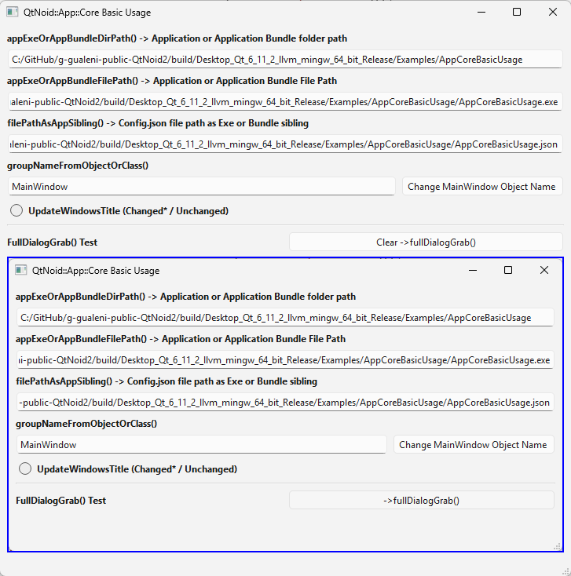
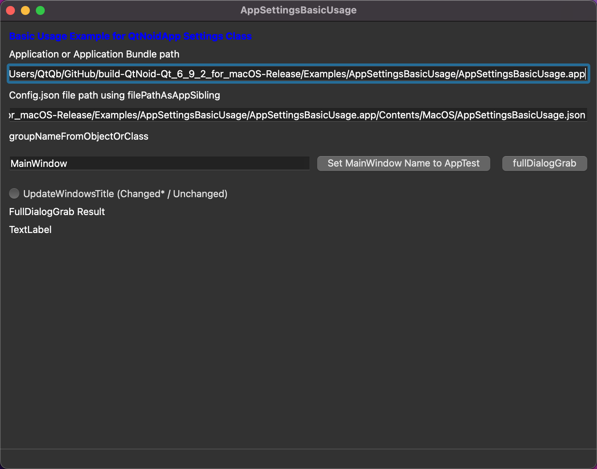

# QtNoid::App::Core Basic Usage
This example shows how the following support methods work:
* QtNoid::App::Core::appExeOrAppBundleDirPath() 
* QtNoid::App::Core::appExeOrAppBundleFilePath()
* QtNoid::App::Core::filePathAsAppSibling()
* QtNoid::App::Core::groupNameFromObjectOrClass()
* QtNoid::App::Core::fullDialogGrab()

## Used libraries
* [QtNoidApp](QtNoidApp.md) 

## Windows 11

## macOS

⬆[Examples](../../Examples.md)

[← Back to README](../../../README.md)
