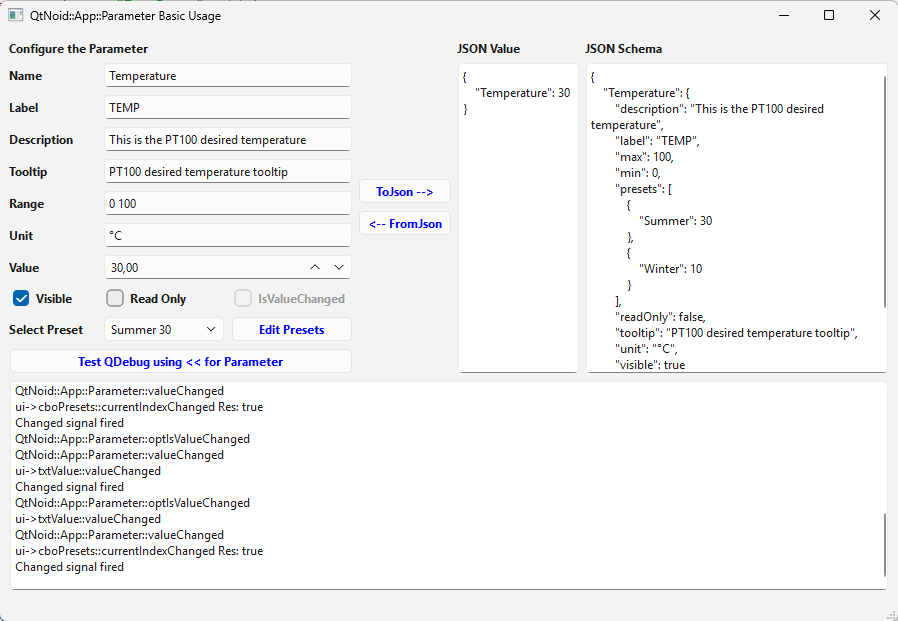

# QtNoid::App::Parameter Basic Usage
This is a simple Qt application that showcases how to use the QtNoid::App::Parameter class from QtNoid::App and how it can be converted to and from a JSON Value and a JSON Schema. 
Presets, ReadOnly and IsValueChanged are also implemented.
The changed() signal and the writeAttemptedWhileReadOnly() are also connected.

## Windows 11

## macOS

⬆[Examples](../../Examples.md)

[← Back to README](../../../README.md)
