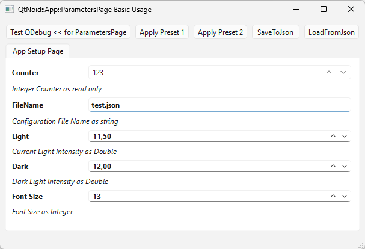
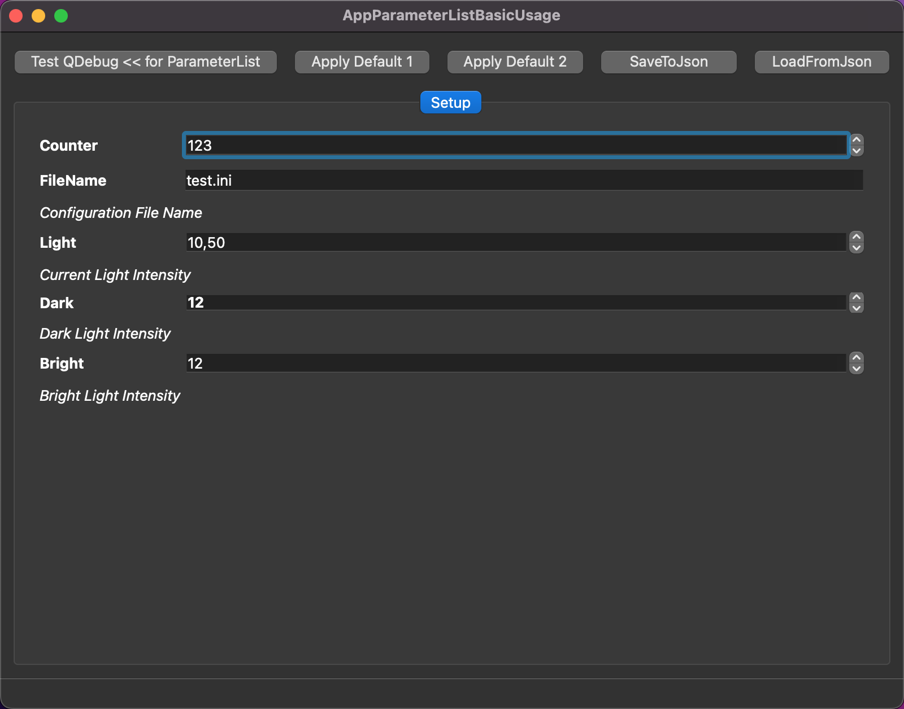

# QtNoid::App::ParametersPage Basic Usage
This example shows how a UI can be created from a ParametersPage and how we can load and restore a configuration using a JSON file.
There is also an example regarding the application of 2 different preset.
And when each single paramter is modified, it is printed in bold. 

## Windows 11

## ==macOS - UPDATE

⬆[Examples](../../Examples.md)

[← Back to README](../../../README.md)
