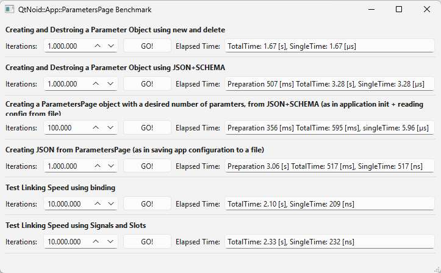
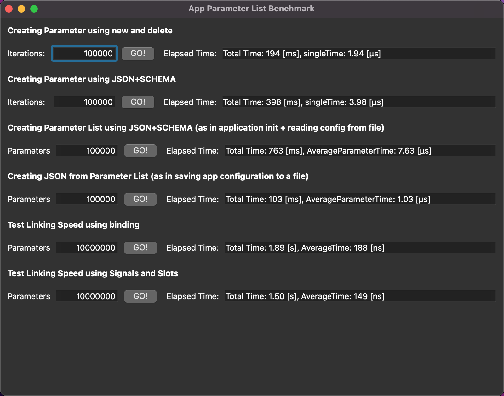

# QtNoid::App::Parameter Benchmark

In this example we can compare different methods to create an object [QtNoid::App::Parameter](QtNoidApp.md) and check the performances:
* new **QtNoid::App::Parameter()**: this use **new** to create a new parameter
* **QtNoid::App::Parameter p(schema, value)** in this case we create a parameter from JSON schema and value.

We can also see how the number of parameters impacts on the creation of a QtNoid::App::ParamtersPage object, using **ParametersPage(mainSchema, mainValue)**
Or how it impacts the creation of a JSON doc from a big ParametersPage object.

The last 2 test are to compare how faster is binding compared to the classical Signals and Slot.

## Windows 11

## macOS

⬆[Examples](../../Examples.md)

[← Back to README](../../../README.md)

