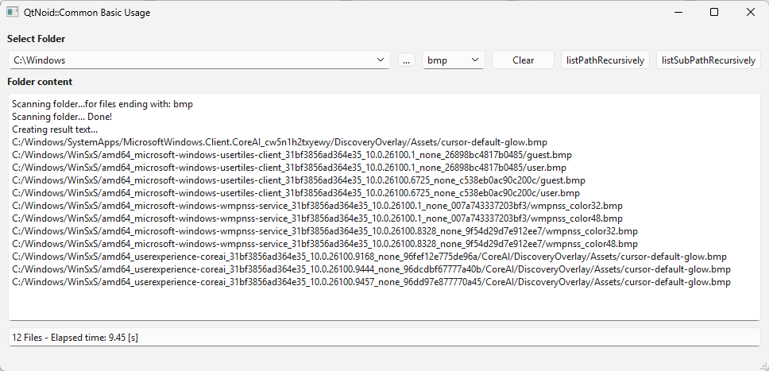
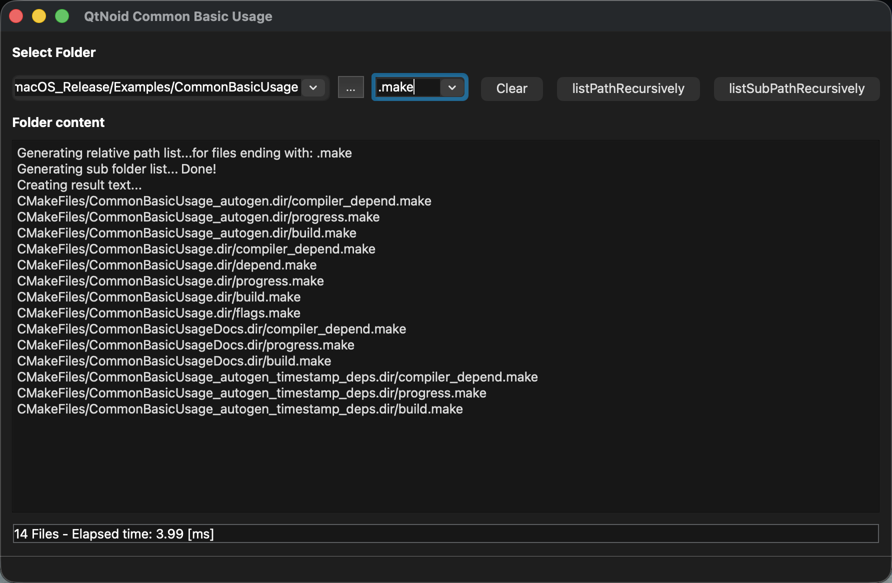

# Overview
This example implement shows how QtNoid::Common features can be used.
Currently it shows a live example of:
- `QtNoid::Common::File::listPathRecursively()`
- `QtNoid::Common::File::listSubPathRecursively`

This can be used to test the speed of the API on different platforms.
## Windows 11

## macOS

[← Back to README](../../../README.md)
