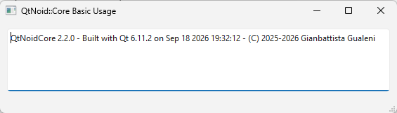
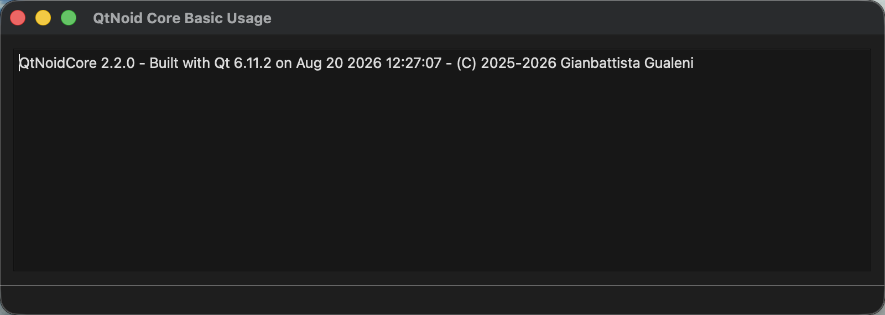

# Overview
This example demonstrates the basic usage of QtNoidCore library printing on screen the result of `QtNoid::Core::buildInfo()`

## Win11

## macOs

## See Also
-  [[QtNoidCore]] library documentation

⬆[[Examples]]
[← Back to README](../../../README.md)
